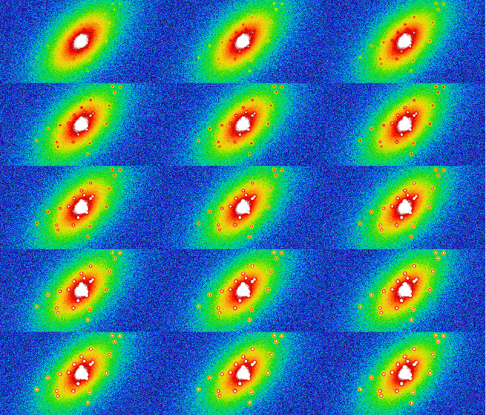
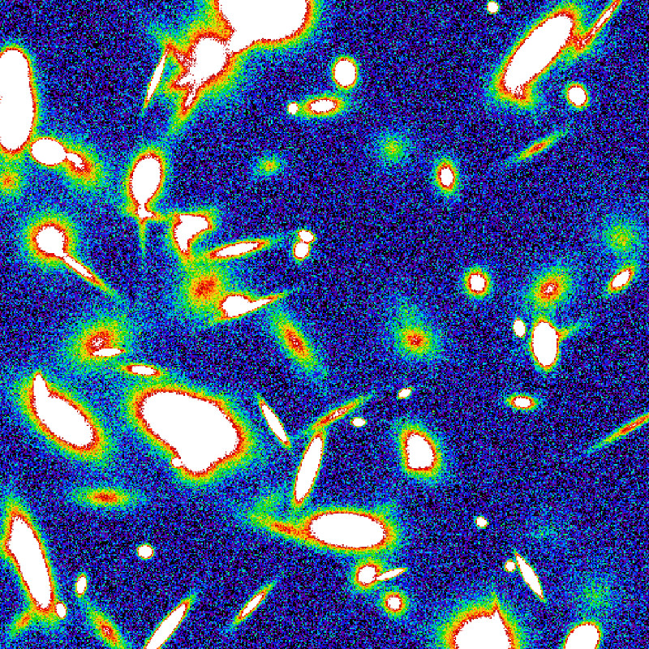
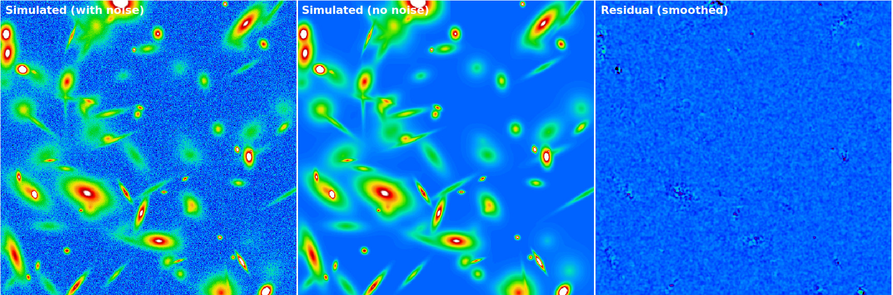
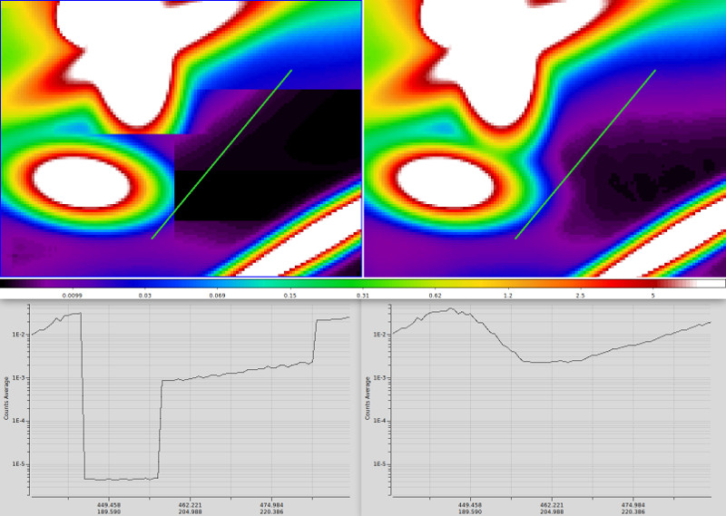
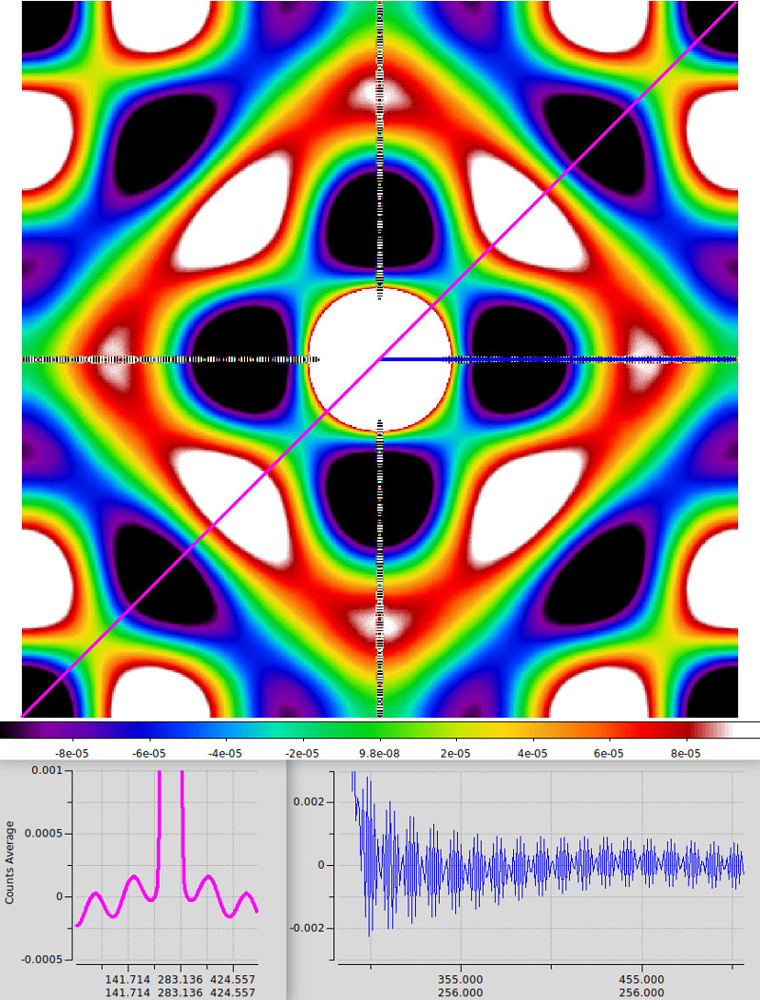
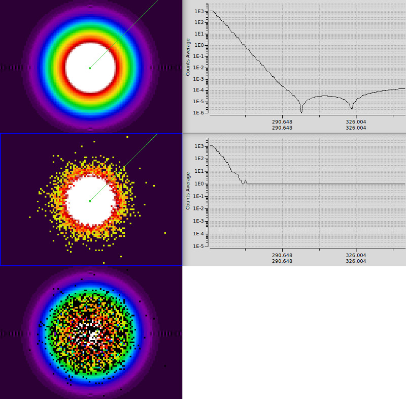

# GalSim Test Runs

Some basic tests, testing the capabilities of GalSim

## test01

A simple de Vaucouleurs bulge + exponential disk, with 25 added star-forming knots at 1% of the disk level. Poisson noise added, and image convolved with a Moffat PSF.

## test02

A test at reading in catalogue data from an external file. A similar galaxy as in test01 is used, with a varying SF knot flux from 1-15% (ensuring always that knot flux + disk flux = 90%).

## test03

Showing the ability to pull multiple files from one YAML document. Here I output the convolution PSF first, before outputting the convolved galaxy image second. This necessitates the use of two '---' dividers, splitting the document into three parts: A) global properties, B) output the PSF image, C) output the galaxy image. To quote the demo text, this does this:

> &#35; The multiple yaml documents are separated by a line with three dashes "---"  
> &#35; The first document has all the parts that are common to all the output files.  
> &#35; Then each subsequent document defines its particular additions to that base.  
> &#35; These are combined with the first document's information for processing.  
> &#35; So if we start numbering the documents at 0, we effectively process:  
> &#35;   doc[0] + doc[1]  
> &#35;   doc[0] + doc[2]  
> &#35;   doc[0] + doc[3]  
> &#35;   ...  

## test04

Using the index Sequence type to repeat each item in a list a given number of times. 

## test05

Testing the ability for GalSim to randomly assign object properties, in this case galaxy size (half light radius) via the 'dilate' argument.

Additionally, postage stamps of 64x64 pixels are constructed on a 10x10 grid, and output to a single FITS file. A zero count border of 1 pixel in the x direction and 5 pixels in the y direction is included, for clarity.

## test06

First attempt at generating an image with multiple galaxies. This image contains 100 'InclinedExponential' galaxies randomly scattered across the field of view. Flux values are drawn from a power law distribution. Other key parameters are drawn from random uniform distributions. A flat sky pedestal is assumed in order to calculate Poisson noise for each pixel. 

This test also outputs the input parameters into a truth catalogue for later further processing. GalSim can be instructed to use all available processors in order to speed up the image generation process.

Four output images are constructed: with and without noise, each with and without galaxy profile clipping. To facilitate this in a single file, use of the above '---' divider notation is required.

### test06: 100 inclined exponential disk galaxies on a 512x512 image

### test06: residual = with noise - without noise

### test06: boundary box clipping

## test07

A simple circular exponential (Re=5 px, flux=1E5 counts) on a 512x512 plane. 

The first image highlights background artefacts introduced during the model generation stage. 

The second image shows the difference imparted on profile generation when using no noise and applying Poisson noise at zero counts. Poisson noise must be discretised, which introduces this effect.

Both topics are for discussion as to how best to manage going forward. 

### artefacts

### discretisation

## test08

Store PSF and truth catalogue information in extension HDUs, rather than additional files. Opening the resultant output FITS file in DS9 will show 2 image HDUs (science image and associated PSFs), whilst opening in TOPCAT will show the complete truth catalogue.

## test09

Almost final prep file, exhibiting most (all?) of the desired markup for our purposes. Simulates 5 Sersic galaxies, at given positions, with CCD noise (Poisson shot + Gaussian read).

## test10

Final test. Based on test09 above, but reading in all galaxy specific markers from a pre-defined input file. A similar setup to be used in furter LSB source detection efforts.

<a href="#top">↥ back to top</a>

